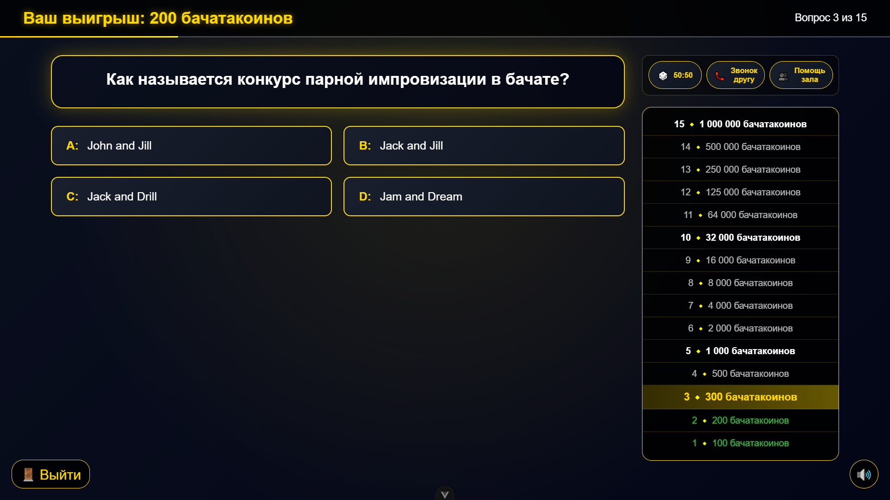

# 🎮 Кто хочет стать миллионером — БачатаМания Edition

Интерактивная викторина "Кто хочет стать миллионером", адаптированная для мероприятия Натальи Братовой. Игра с полным звуковым сопровождением, тремя подсказками и динамической системой вопросов.



## 🌐 Демо

[Играть онлайн](https://baikhonov.github.io/millionaire-game-natalya-bratova/)

## ✨ Особенности

- 🎵 **Полное звуковое сопровождение** — фоновая музыка, звуки выбора ответа, победы и поражения, подсказки
- 📚 **Система сетов** — несколько наборов по 15 вопросов, автоматическое переключение после каждой игры
- 💡 **Три подсказки**:
  - 50:50 — удаляет два неверных варианта
  - Звонок другу — таймер на 30 секунд для обсуждения
  - Помощь зала — интерактивное голосование зрителей
- 🏆 **Несгораемые суммы** — уведомления при достижении 1000₽ и 32000₽
- 📱 **Адаптивный дизайн** — корректно работает на ПК, планшетах и смартфонах
- 🎨 **Аутентичный интерфейс** — стилизация под классическую игру "Кто хочет стать миллионером"
- 🚪 **Кнопка выхода** — фиксирует текущий выигрыш и завершает игру

## 🛠️ Технологии

- **Vue 3** — современный фреймворк с Composition API
- **TypeScript** — типизация компонентов и данных
- **Vite** — быстрая сборка и разработка
- **GitHub Pages** — хостинг и автодеплой через GitHub Actions

## 🎮 Как играть

1. Нажмите **"Начать игру"** на стартовом экране
2. Варианты ответов появляются по очереди (A → B → C → D)
3. Выберите вариант (можно передумать до нажатия кнопки)
4. Нажмите **"Показать правильный ответ"**, чтобы узнать результат
5. При правильном ответе — переход к следующему вопросу
6. При неправильном — игра завершается с фиксацией выигрыша

### Подсказки

- **50:50** — убирает два неверных варианта (1 раз за игру)
- **Звонок другу** — оффлайн, вынесено за пределы кода
- **Помощь зала** — оффлайн, вынесено за пределы кода

## 📁 Структура проекта

```
📁 src/
├── 📁 assets/ # Стили и статические файлы
├── 📁 components/ # Vue компоненты
│ ├── 📁 game/ # Игровые компоненты
│ ├── 📁 media/ # Аудио/видео плееры
│ └── 📁 ui/ # UI компоненты (модалки, таймер)
├── 📁 composables/ # Composition API логика
├── 📁 types/ # TypeScript интерфейсы
└── 📁 config/ # Конфигурация валюты и путей
```

## 🚀 Установка и запуск

# Клонирование репозитория

```bash
git clone https://github.com/baikhonov/millionaire-game-natalya-bratova.git
cd millionaire-game-natalya-bratova
```

# Установка зависимостей

```bash
npm install
```

# Запуск в режиме разработки

```bash
npm run dev
```

# Сборка для продакшена

```bash
npm run build
```

# Предпросмотр собранного проекта

```bash
npm run preview
```

## 📦 Автоматический деплой

При пуше в ветку main запускается GitHub Actions, который:

Устанавливает зависимости

Собирает проект

Деплоит на GitHub Pages

Сайт доступен по адресу: https://baikhonov.github.io/millionaire-game-natalya-bratova/

## 🙏 Благодарности

Вдохновлено классической телевизионной игрой "Кто хочет стать миллионером"
